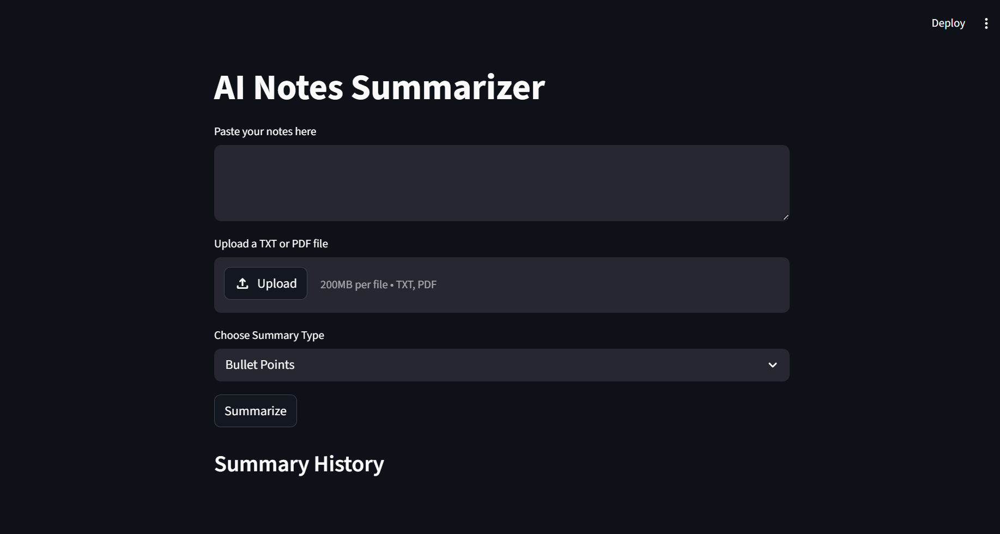
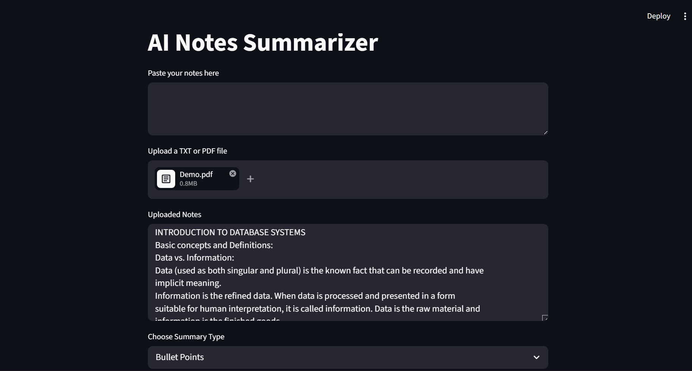
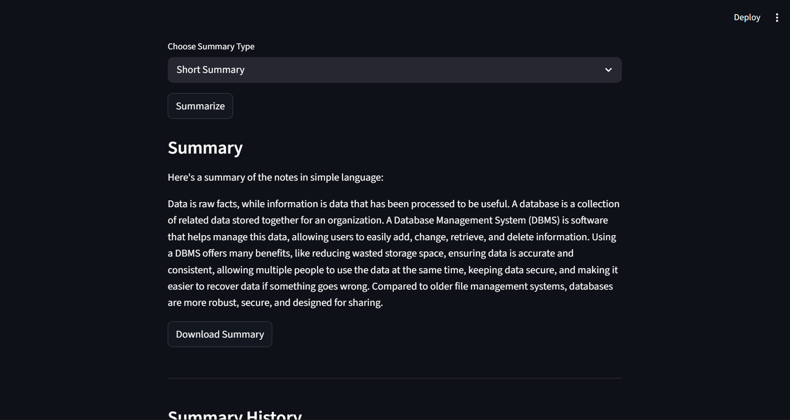
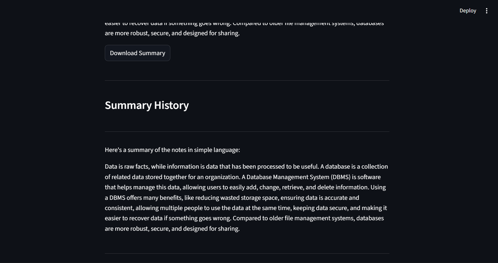

# AI Notes Summarizer

An AI-powered Notes Summarizer built using Python, Streamlit, and Google Gemini API.

The application can summarize:
- Raw text notes
- TXT files
- PDF documents

It also supports multiple summarization styles such as:
- Bullet Points
- Short Summary
- Detailed Summary
- Beginner Friendly

---

## Features

- AI-powered note summarization
- TXT file upload support
- PDF file upload support
- Multiple summary styles
- Download generated summaries
- Summary history tracking
- Loading spinner and error handling
- Text preprocessing pipeline
- Modular project architecture

---

## Tech Stack

- Python
- Streamlit
- Google Gemini API
- pypdf
- python-dotenv

---

## Project Structure

```bash
AI-Notes-Summarizer/
│
├── app.py
├── summarizer.py
├── requirements.txt
├── screenshots/
├── .gitignore
├── README.md
````

---

## Installation

### 1. Clone Repository

```bash
git clone https://github.com/decoded15/Notes-Summarizer.git
cd Notes-Summarizer
```

### 2. Create Virtual Environment

```bash
python -m venv venv
```

### 3. Activate Virtual Environment

#### Windows

```bash
venv\Scripts\activate
```

### 4. Install Dependencies

```bash
pip install -r requirements.txt
```

### 5. Add Gemini API Key

Create a `.env` file:

```env
GEMINI_API_KEY=your_api_key_here
```

---

## Run The Application

```bash
streamlit run app.py
```

---

## Features Implemented Incrementally

* Gemini API integration
* Dynamic prompt engineering
* Multiple summary modes
* TXT file upload support
* PDF text extraction
* Text preprocessing pipeline
* Download summary feature
* Summary history tracking
* Error handling and validation

---

## Concepts Learned

This project helped in understanding:

* LLM APIs
* Prompt Engineering
* Environment Variables
* Streamlit UI
* File Handling
* PDF Text Extraction
* Text Preprocessing
* Error Handling
* Session State Management
* AI Workflow Architecture

---

## Future Improvements

* Chunking large PDFs
* Token counter
* Flashcard generation
* PDF summary export
* Chat with PDF
* Multi-language summarization

---

## Screenshots

### Home Page



---

### PDF Upload



---

### Generated Summary




---

## Author

Built by Dibyansh (decoded15)


